# <Kara-Poole-Blog>

## Description

The purpose of this project was to create a personal blog website that could store and retrieve data for blog posts from local storage. Labels and inputs were used to create a form to simplify creating a blog entry. Users are asked for a username, blog title, and blog content. If a user attempts to submit any blank fields, they are prompted by an alert to complete the form.

When a user submits the form, the site stores their data in local storage as a JSON array user is directed to a second page. The site then retrieves the user’s entry (along with any other previous entries) and displays it on this second page. Each blog entry is accompanied by the blog’s title and the user’s chosen username. A back button was include on the second page so the user can easily navigate back to the form and create more entries.

Both the form page and the second blog entries page has a toggle that allows users to switch between dark and light mode. A link to the developer’s portfolio was included in the footer of both pages.

## Table of Contents

If your README is long, add a table of contents to make it easy for users to find what they need.

- [Usage](#usage)
- [Application](#application)
- [Credits](#credits)
- [License](#license)

## Usage

### Blog Submission Form

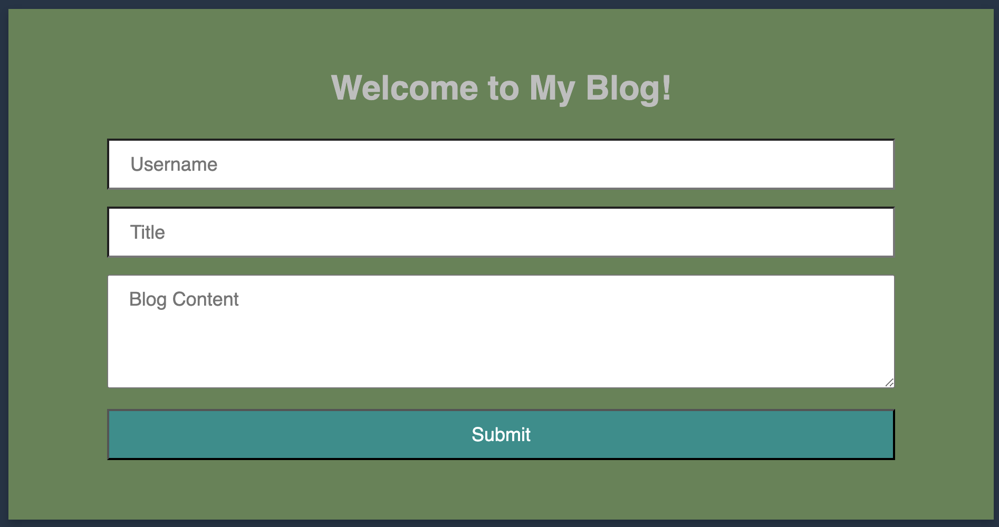

### Alert

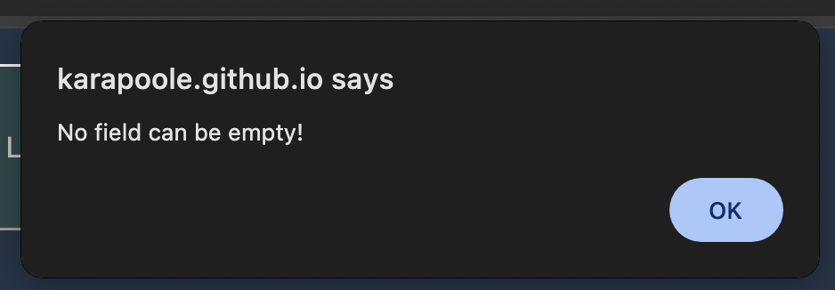

### Local Storage

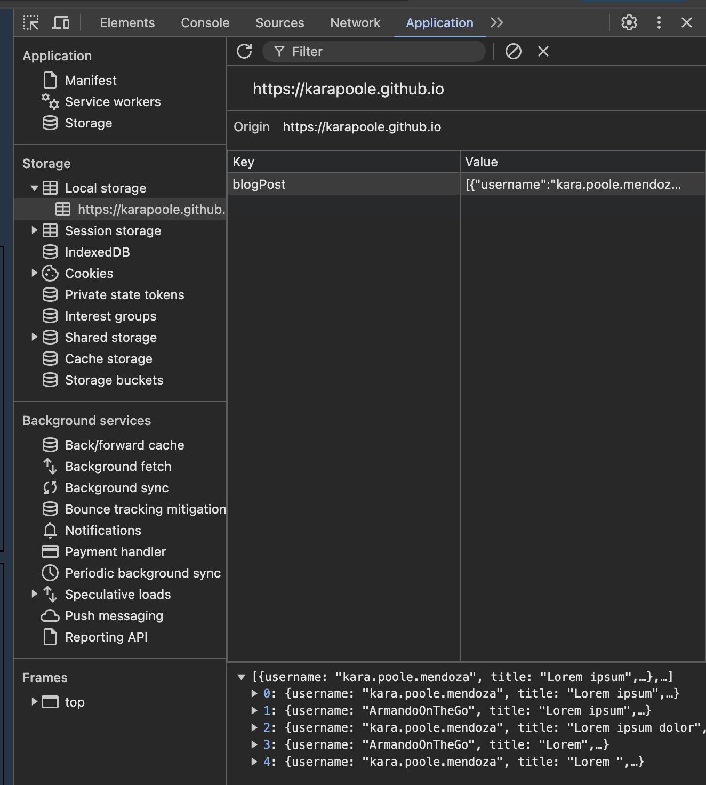

### Dark and Light Mode Toggle

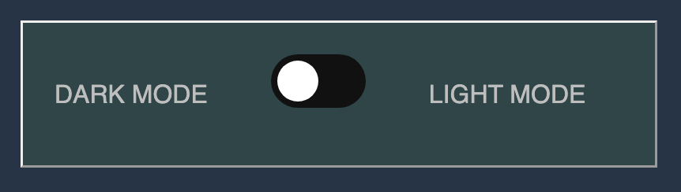 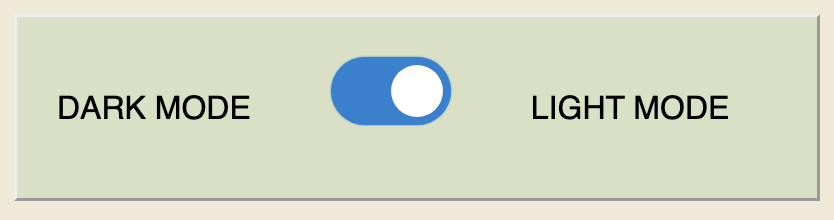

### Blog Post with Username, Blog Title, and Blog Content

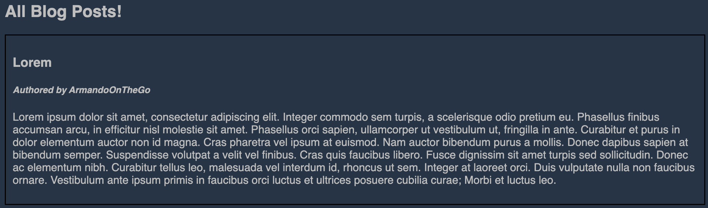

### Back Button

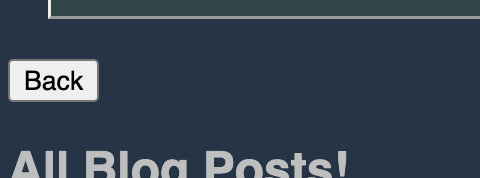

### Link to Developer Portfolio

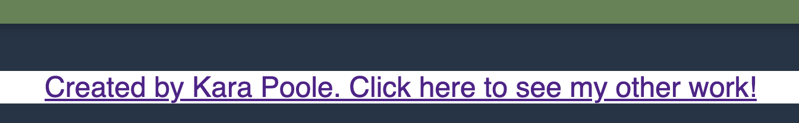

## Application

### Deployed Application URL: https://karapoole.github.io/Kara-Poole-Blog/index.html

### Screenshots:

#### Form Page Dark Mode

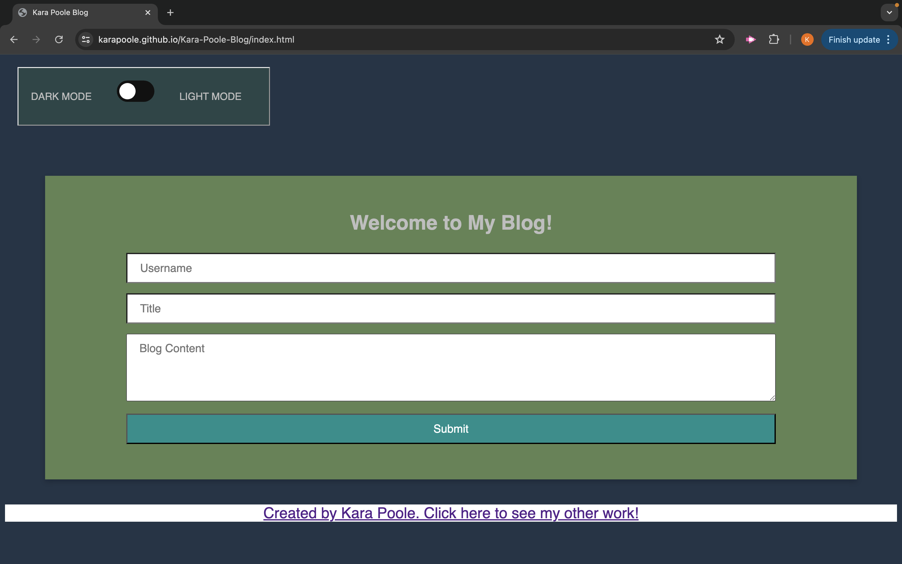

#### Form Page Light Mode

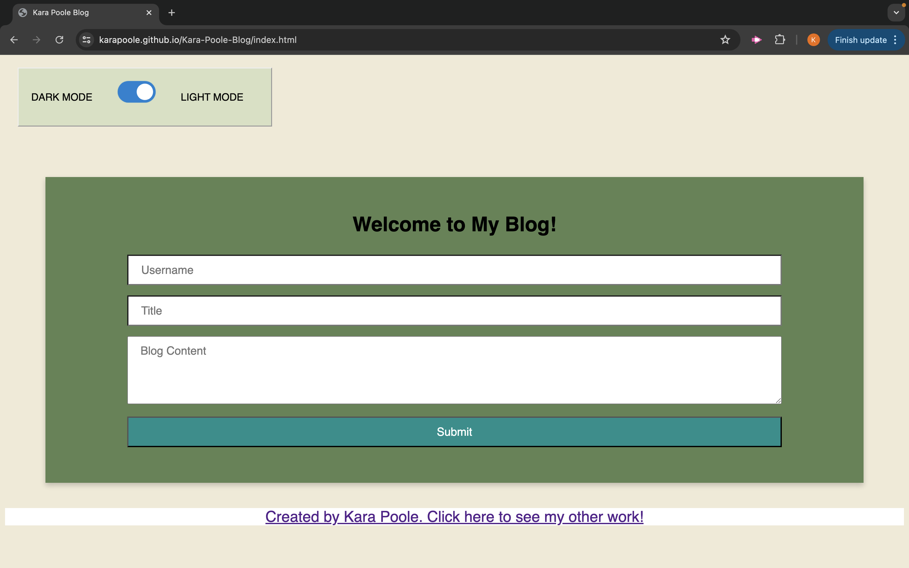

#### Blog Page Dark Mode

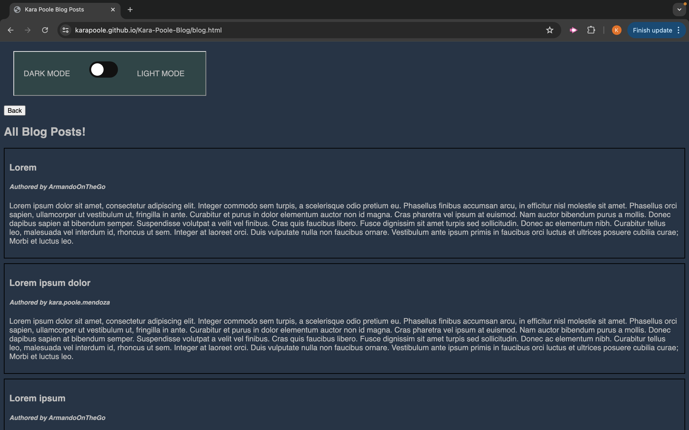

#### Blog Page Light Mode

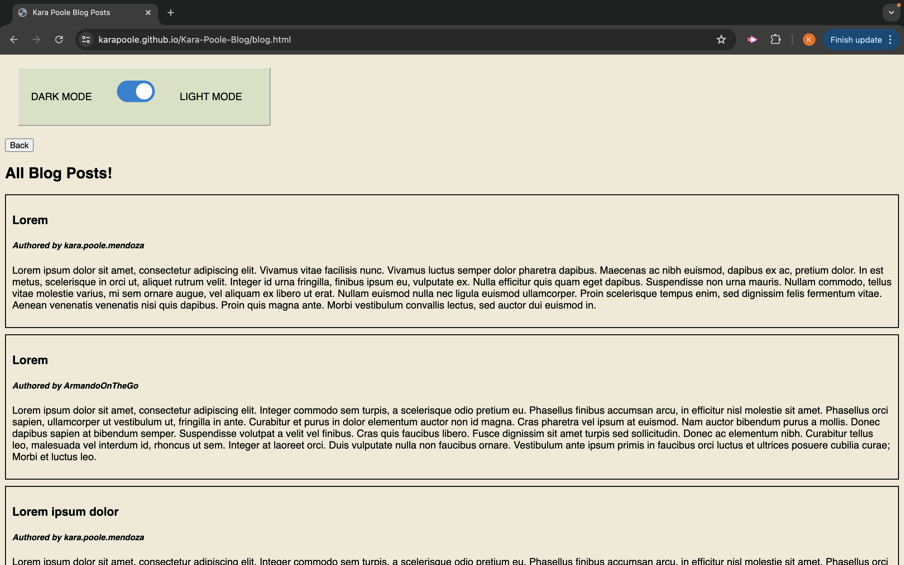

## Credits

edX curriculum

## License

Please refer to liscense in repo.
